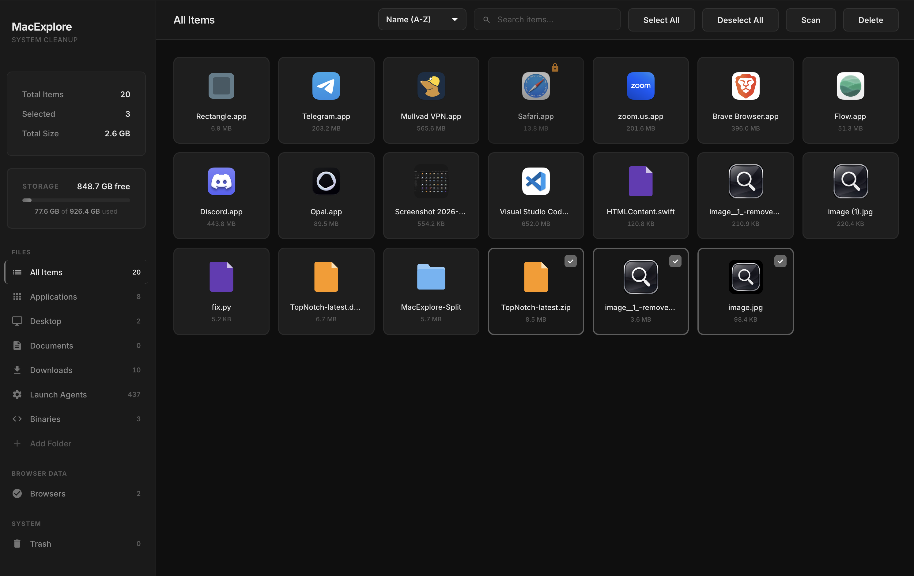
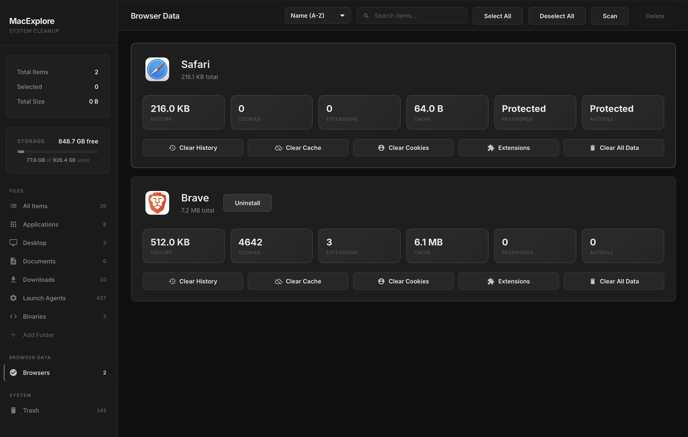
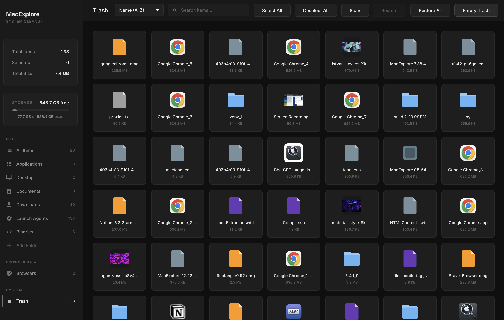
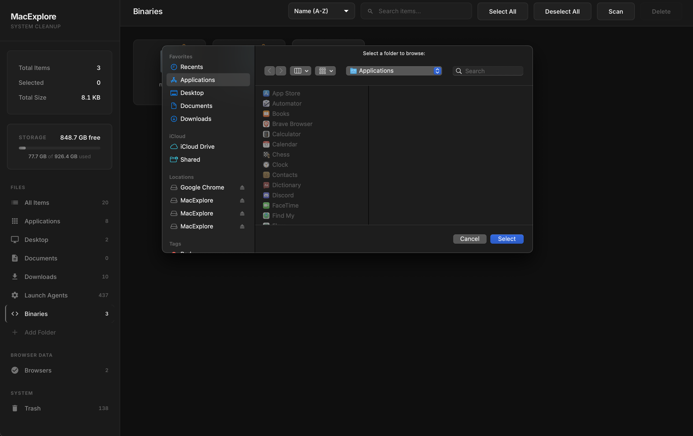

# MacExplore

A lightweight macOS utility for browsing and cleaning up files on your system.

## Screenshots

## Features

- **Quick File Browser** - Browse Applications, Desktop, Documents, Downloads, and more
- **Browser Data Cleanup** - View and manage Safari, Chrome, Firefox, Arc, and Brave cache/data
- **Trash Management** - View, restore, or permanently delete items in Trash
- **Custom Folders** - Add any folder to the sidebar for quick access
- **File Search** - Filter items by name across any category
- **Drag Selection** - Select multiple files by dragging
- **Keyboard Shortcuts** - Cmd+A to select all, Delete/Backspace to trash, Cmd+F to search

## Permissions

MacExplore may request access to:

- **Desktop, Documents, Downloads** - To scan and display files in these locations
- **Full Disk Access** (optional) - Required to view Trash contents and Safari data